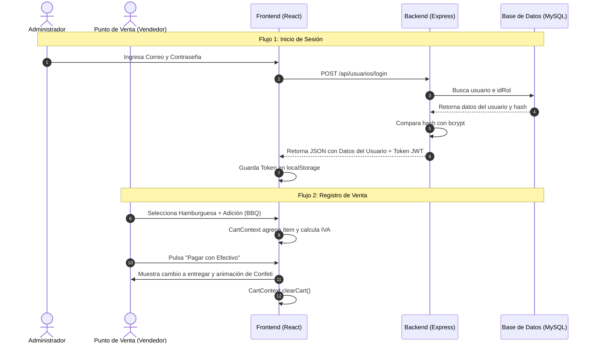

# 📖 EXPLICACIÓN COMPLETA DEL CÓDIGO - CHAZIN FOOD

Este documento detalla exhaustivamente la estructura, arquitectura, dependencias y el flujo de código de la plataforma **Chazin Food**, tanto para el **Backend (servidor de APIs)** como para el **Frontend (interfaz de usuario web)**.

---

## 🏗️ 1. Arquitectura General del Sistema

El proyecto **Chazin Food** está diseñado con una arquitectura dividida en dos partes:
1. **Backend**: Un servidor RESTful construido con **Node.js + Express** que interactúa principalmente con una base de datos relacional **MySQL** (y que tiene componentes preparados para **MongoDB** mediante **Mongoose**). Ofrece autenticación segura con **JSON Web Tokens (JWT)** y documentación viva mediante **Swagger**.
2. **Frontend**: Una aplicación de página única (SPA) construida con **React + Vite**, estilada con **Tailwind CSS v4** y componentes de **Material-UI (MUI)**. Está organizada bajo principios de **Clean Architecture** (Arquitectura Limpia), separando la lógica en capas de Presentación, Dominio, Datos y Aplicación.

---

## 📁 2. Estructura de Directorios

El espacio de trabajo se divide en dos carpetas principales:

```text
Web Chazin Food/
├── backend/                  # Servidor de API, base de datos y lógica de servidor
│   ├── server.js             # Punto de entrada de la aplicación Express
│   ├── .env                  # Variables de entorno (puertos, claves de bases de datos, SMTP)
│   ├── package.json          # Dependencias y scripts del Backend
│   ├── test_conn.js          # Script para probar conexiones y auto-crear tablas MySQL
│   ├── seed.js               # Script para insertar datos semilla iniciales
│   ├── alter_tables.js       # Script de migraciones menores de bases de datos
│   └── src/
│       ├── config/           # Configuraciones de Base de Datos y Swagger
│       ├── controllers/      # Controladores de solicitudes HTTP (lógica de negocio)
│       ├── middlewares/      # Interceptores de peticiones (Autenticación y Errores)
│       ├── models/           # Definiciones de entidades y comunicación con bases de datos
│       └── routes/           # Rutas expuestas de la API
│
└── frontend/                 # Aplicación del lado cliente (React)
    ├── package.json          # Dependencias y scripts del Frontend
    ├── vite.config.ts        # Configuración de compilación con Vite y Tailwind
    ├── index.html            # Plantilla HTML raíz
    └── src/
        ├── main.jsx          # Punto de entrada de renderizado de React
        ├── App.jsx           # Componente base que envuelve los proveedores globales
        ├── application/      # Capa de enrutamiento y lógica de aplicación global
        ├── domain/           # Capa de dominio (Estado global de React, hooks, reglas de negocio)
        ├── data/             # Capa de datos (Servicios de API externos, utilidades globales)
        └── presentation/     # Capa de presentación (Páginas, componentes visuales, estilos)
```

---

## ⚙️ 3. Explicación Detallada del Backend

### 📄 3.1. Configuraciones Raíz
*   **[server.js](file:///home/agp/Documentos/Web%20Chazin%20Food/backend/server.js)**: 
    *   Carga las variables de entorno desde el archivo `.env` mediante `dotenv.config()`.
    *   Inicializa la aplicación Express y establece middlewares de seguridad y logging:
        *   `express.json()`: Para analizar cuerpos de peticiones JSON.
        *   `cors()`: Habilita el Intercambio de Recursos de Origen Cruzado para permitir llamadas desde el frontend.
        *   `helmet()`: Asegura las cabeceras HTTP (configurado con `contentSecurityPolicy: false` para que la interfaz interactiva de Swagger se renderice sin problemas).
        *   `morgan('dev')`: Genera logs en la consola para cada solicitud HTTP recibida.
    *   Lanza la documentación de **Swagger UI** en la ruta `/api-docs` y redirige la raíz `/` allí de manera predeterminada.
    *   Monta los enrutadores principales bajo el prefijo `/api/`.
    *   Define un middleware global de manejo de errores (`errorHandler`).
*   **[.env](file:///home/agp/Documentos/Web%20Chazin%20Food/backend/.env)**:
    *   Almacena claves secretas y credenciales.
    *   Contiene variables de bases de datos tanto para MongoDB (`MONGO_URI`) como para MySQL (`DB_HOST`, `DB_USER`, `DB_PASSWORD`, `DB_NAME`, `DB_PORT`).
    *   Configura el servidor SMTP de correos electrónicos para el envío de enlaces de recuperación de contraseñas.

---

### 🗃️ 3.2. Capa de Configuración (`src/config`)
*   **[db.js](file:///home/agp/Documentos/Web%20Chazin%20Food/backend/src/config/db.js)**:
    *   Utiliza la librería `mysql2/promise` para crear un **Pool de Conexiones** reutilizables a MySQL. Un pool es más eficiente que abrir y cerrar conexiones individuales de manera repetida.
    *   Prueba la conexión al arrancar el servidor mediante `getConnection()`. Si MySQL está inactivo, avisa por consola pero permite que el servidor continúe ejecutándose para fines de depuración.
*   **[swagger.js](file:///home/agp/Documentos/Web%20Chazin%20Food/backend/src/config/swagger.js)**:
    *   Configura los metadatos OpenAPI (versión de la API, título, descripción, servidores de prueba y esquemas de seguridad como el portador Bearer JWT).
    *   Escanea los comentarios JSDoc dentro de las rutas y controladores para autogenerar la documentación interactiva en formato JSON.

---

### 🛡️ 3.3. Middlewares (`src/middlewares`)
*   **[authMiddleware.js](file:///home/agp/Documentos/Web%20Chazin%20Food/backend/src/middlewares/authMiddleware.js)**:
    *   **`protect`**: Intercepta peticiones protegidas. Extrae el token JWT de la cabecera `Authorization: Bearer <token>`, lo verifica con `jsonwebtoken` usando la clave secreta y busca el usuario correspondiente en la base de datos.
        *   *Control Adicional*: Verifica si el estado del usuario es activo. Si está inactivo, rechaza la petición.
        *   *Rol de Administrador*: Valida que el usuario tenga un rol autorizado (el perfil por defecto está protegido para Administradores, pero se puede flexibilizar).
        *   Remueve la contraseña del objeto de usuario y adjunta la información segura a `req.user`.
    *   **`authorize(...roles)`**: Un generador de middlewares para validar que el rol del usuario autenticado coincida con alguno de los roles permitidos en la ruta específica (por ejemplo, permitir solo a "cocinero" o "administrador").
*   **[errorMiddleware.js](file:///home/agp/Documentos/Web%20Chazin%20Food/backend/src/middlewares/errorMiddleware.js)**:
    *   Captura excepciones no controladas de la aplicación, formatea la respuesta en un JSON estructurado `{ message: error.message, stack: ... }` y devuelve el código de estado HTTP adecuado (por defecto 500).

---

### 💾 3.4. Capa de Modelos (`src/models`)
El proyecto emplea una base de datos híbrida o en proceso de migración:
1.  **Modelos MySQL directos con Clases y Consultas SQL**:
    *   **[User.js](file:///home/agp/Documentos/Web%20Chazin%20Food/backend/src/models/User.js)**: Maneja los usuarios y hereda relaciones con la tabla `cliente` para guardar direcciones cuando se trata de ese rol. 
        *   *Detalle técnico crucial*: Para que el controlador existente (que originalmente fue escrito para MongoDB/Mongoose) no se rompiera, esta clase implementa wrappers de compatibilidad como `findOne()`, `findById()`, `findByEmail()` y `.select()`. Devuelve una promesa que simula la interfaz encadenable de Mongoose.
        *   Utiliza `bcryptjs` para encriptar contraseñas antes del guardado y comprobar contraseñas en el login (`matchPassword`).
    *   **[Category.js](file:///home/agp/Documentos/Web%20Chazin%20Food/backend/src/models/Category.js)**: Representa las categorías de insumos en MySQL, incluye migración automática al arrancar para asegurar que la tabla `categoria_insumo` exista.
    *   **[insumoModel.js](file:///home/agp/Documentos/Web%20Chazin%20Food/backend/src/models/insumoModel.js)**: Representa los insumos e ingredientes individuales. Al iniciarse, ejecuta `initInsumoTable()` para alterar la tabla y añadir columnas que pudiesen faltar (como precioUnitario, idProveedor o descripción).
    *   **[insumoPreparadoModel.js](file:///home/agp/Documentos/Web%20Chazin%20Food/backend/src/models/insumoPreparadoModel.js)**: Representa insumos complejos creados a partir de otros insumos (recetas o preparaciones intermedias). Gestiona transacciones de MySQL para insertar en la tabla cabecera y el detalle (`detalleinsumopreparadoinsumo`) concurrentemente.
    *   **[proveedorModel.js](file:///home/agp/Documentos/Web%20Chazin%20Food/backend/src/models/proveedorModel.js)**: Entidad que maneja los proveedores de la cadena de suministro.
    *   **[trazabilidadModel.js](file:///home/agp/Documentos/Web%20Chazin%20Food/backend/src/models/trazabilidadModel.js)**: Registra eventos clave en el sistema para auditoría y logs de operación (quién hizo qué y cuándo).
2.  **Modelos MongoDB (Mongoose)**:
    *   **[Product.js](file:///home/agp/Documentos/Web%20Chazin%20Food/backend/src/models/Product.js)**: Esquema de Mongoose que define los productos que se venden en el menú. Incluye nombre, precio, descripción, stock, categoría y un array de subdocumentos para **adiciones** (salsas, bebidas, ingredientes extra).
    *   **[Order.js](file:///home/agp/Documentos/Web%20Chazin%20Food/backend/src/models/Order.js)**: Esquema de Mongoose para registrar los pedidos realizados por los clientes.

---

### 🎮 3.5. Capa de Controladores y Rutas (`src/controllers` y `src/routes`)
Los controladores reciben los parámetros de las peticiones (`req.body`, `req.params`, `req.query`), ejecutan la lógica llamando a los modelos y devuelven respuestas JSON estructuradas.

Las rutas asocian los endpoints HTTP con sus respectivos controladores y middlewares de protección.

| Enrutador | Prefijo de Ruta | Funcionalidades Clave | Controladores Asignados |
| :--- | :--- | :--- | :--- |
| **[authRoutes.js](file:///home/agp/Documentos/Web%20Chazin%20Food/backend/src/routes/authRoutes.js)** | `/api/autenticacion` | Registro inicial, Login básico y consulta de perfil actual. | `registerUser`, `authUser`, `getUserProfile` |
| **[userRoutes.js](file:///home/agp/Documentos/Web%20Chazin%20Food/backend/src/routes/userRoutes.js)** | `/api/usuarios` | Gestión de usuarios (CRUD), recuperación de contraseña vía correo y desactivación lógica. | `registerUser`, `loginUser`, `updateUserProfile`, `createUser`, `forgotPassword`, etc. |
| **[categoryRoutes.js](file:///home/agp/Documentos/Web%20Chazin%20Food/backend/src/routes/categoryRoutes.js)** | `/api/categorias` | CRUD de las categorías generales del sistema. | `getCategories`, `createCategory`, etc. |
| **[productRoutes.js](file:///home/agp/Documentos/Web%20Chazin%20Food/backend/src/routes/productRoutes.js)** | `/api/productos` | Consulta pública del menú y administración (creación/edición) restringida a administradores. | `getProducts`, `createProduct`, `updateProduct`, `deleteProduct` |
| **[orderRoutes.js](file:///home/agp/Documentos/Web%20Chazin%20Food/backend/src/routes/orderRoutes.js)** | `/api/pedidos` | Gestión de compras/pedidos realizados en el restaurante. | `createOrder`, `getOrders`, etc. |
| **[roleRoutes.js](file:///home/agp/Documentos/Web%20Chazin%20Food/backend/src/routes/roleRoutes.js)** | `/api/roles` | Administración de roles (Administrador, Cocinero, Cliente) y permisos detallados. | `getRoles`, `updateRol`, `deleteRol` |
| **[insumoRoutes.js](file:///home/agp/Documentos/Web%20Chazin%20Food/backend/src/routes/insumoRoutes.js)** | `/api/insumos` | Administración de materias primas en el inventario. Permite restauración y papelera de reciclaje. | `getInsumos`, `createInsumo`, `restoreInsumo`, etc. |
| **[categoriaInsumoRoutes.js](file:///home/agp/Documentos/Web%20Chazin%20Food/backend/src/routes/categoriaInsumoRoutes.js)** | `/api/categorias-insumo` | CRUD de categorías exclusivas para el inventario de cocina. | `getCategorias`, `createCategoria`, etc. |
| **[insumoPreparadoRoutes.js](file:///home/agp/Documentos/Web%20Chazin%20Food/backend/src/routes/insumoPreparadoRoutes.js)** | `/api/insumos-preparados`| Gestión de recetas base elaboradas (ej: salsas preparadas, carnes porcionadas). | `getPreparados`, `createPreparado`, etc. |
| **[proveedorRoutes.js](file:///home/agp/Documentos/Web%20Chazin%20Food/backend/src/routes/proveedorRoutes.js)** | `/api/proveedores` | CRUD de proveedores asociados. | `getProveedores`, `createProveedor`, etc. |
| **[trazabilidadRoutes.js](file:///home/agp/Documentos/Web%20Chazin%20Food/backend/src/routes/trazabilidadRoutes.js)** | `/api/trazabilidad` | Gestión de logs de trazabilidad histórica. | `getLogs`, `createLog`, `clearLogs`, `markAllRead` |

---

### 🛠️ 3.6. Scripts de Base de Datos
*   **[test_conn.js](file:///home/agp/Documentos/Web%20Chazin%20Food/backend/test_conn.js)**: Intenta conectarse a MySQL utilizando credenciales comunes (primero prueba contraseña `'12345'`, luego contraseña vacía típica de XAMPP). Si se conecta correctamente, crea la base de datos `chazinfood` si no existe, crea las tablas core (`rol`, `usuario`, `rolpermiso`) y las inicializa con roles predeterminados.
*   **[seed.js](file:///home/agp/Documentos/Web%20Chazin%20Food/backend/seed.js)**: Inserta registros iniciales necesarios como tipos de proveedores, tipos de documentos, datos de proveedores modelo y estructura de tablas para recetas/detalles de insumos preparados.
*   **[alter_tables.js](file:///home/agp/Documentos/Web%20Chazin%20Food/backend/alter_tables.js)**: Agrega la columna `estado` a las tablas `insumo` e `insumopreparado` en caso de que ya tengan datos creados y se necesite soportar eliminación lógica sin romper la base de datos existente.

---

## 🎨 4. Explicación Detallada del Frontend

El frontend está estructurado para ser modular, escalable y visualmente impresionante.

### 🔌 4.1. Capa de Dominio y Estado (`src/domain`)
*   **[AuthContext.jsx](file:///home/agp/Documentos/Web%20Chazin%20Food/frontend/src/domain/state/AuthContext.jsx)**:
    *   Controla el estado global de autenticación (`user`, `token`, `isAuthenticated`).
    *   Almacena las credenciales en `localStorage` para recordar la sesión tras recargar la pestaña del navegador.
    *   Expone funciones clave: `login(email, contrasena)`, `register(userData)` y `logout()`.
*   **[CartContext.jsx](file:///home/agp/Documentos/Web%20Chazin%20Food/frontend/src/domain/state/CartContext.jsx)**:
    *   Mantiene el estado de las compras en curso en la caja o punto de venta física.
    *   Utiliza lógica avanzada para comparar productos agregados al carrito: dos hamburguesas iguales con diferentes adiciones (ej: una con queso extra y salsa de ajo y otra sin salsas) se procesan como ítems separados en el carrito de compras.
    *   Calcula automáticamente el Subtotal, el IVA (tasa de 19% parametrizada) y el Total a pagar.
*   **[ConfirmContext.jsx](file:///home/agp/Documentos/Web%20Chazin%20Food/frontend/src/domain/state/ConfirmContext.jsx)** y **[ToastContext.jsx](file:///home/agp/Documentos/Web%20Chazin%20Food/frontend/src/domain/state/ToastContext.jsx)**:
    *   Proporcionan diálogos modales de confirmación y pequeñas notificaciones emergentes (toasts) a lo largo del sistema de manera unificada.

---

### 🛣️ 4.2. Enrutamiento y Capa de Aplicación (`src/application`)
*   **[AppRoutes.jsx](file:///home/agp/Documentos/Web%20Chazin%20Food/frontend/src/application/routes/AppRoutes.jsx)**:
    *   Define las rutas públicas (`/login`, `/forgot-password`, `/reset-password`).
    *   Utiliza el componente `ProtectedRoute` para interceptar usuarios no autorizados.
    *   Establece ruteo condicional por roles de usuario:
        *   **Clientes**: Son redirigidos exclusivamente a la landing page interactiva (`ClienteLanding`).
        *   **Cocineros**: Visualizan directamente el panel de cocina (`CocineroDashboard`) y una sección de solo lectura para las Fichas Técnicas.
        *   **Administradores, Gestores o Empleados**: Tienen acceso a la aplicación completa estructurada dentro del componente base `Layout` (Sidebar de navegación, Dashboard interactivo, módulos de Ventas, Compras, Configuración de Roles y Usuarios).

---

### 📺 4.3. Capa de Presentación (`src/presentation`)

#### 🧱 4.3.1. Componentes Base y Layout
*   **[Layout.jsx](file:///home/agp/Documentos/Web%20Chazin%20Food/frontend/src/presentation/components/Layout.jsx)**:
    *   Estructura la barra lateral de navegación (Sidebar) responsiva.
    *   Soporta colapsado automático en dispositivos móviles y modo oscuro/claro global.
    *   Filtra los enlaces de la barra lateral dependiendo de los privilegios del usuario logueado.

#### 📄 4.3.2. Páginas Principales
*   **[Dashboard.jsx](file:///home/agp/Documentos/Web%20Chazin%20Food/frontend/src/presentation/pages/Dashboard.jsx)**:
    *   Panel administrativo principal cargado con tarjetas informativas de KPIs (Ventas totales, Compras, Clientes activos e Insumos en alerta de stock).
    *   Integra gráficas interactivas construidas con **Recharts** (gráfica de área para tendencias de ingresos/gastos y de barra para productos populares).
    *   Soporta alertas visuales de reabastecimiento en tiempo real.
*   **Módulo de Ventas (`pages/ventas`)**:
    *   **[Venta.jsx](file:///home/agp/Documentos/Web%20Chazin%20Food/frontend/src/presentation/pages/ventas/Venta.jsx)**: La caja/POS. Permite buscar productos y filtrarlos por categorías. Cuenta con:
        *   *Modal de Adiciones*: Al pulsar un producto, se abre un modal con la información, stock y opciones de adiciones (salsas, ingredientes, acompañamientos, bebidas) con sus respectivos precios y stocks.
        *   *Carrito responsivo*: En pantallas grandes se mantiene visible en el lateral derecho y en móviles se accede mediante un botón flotante que despliega una pantalla completa.
        *   *Proceso de pago*: Calcula el IVA, aplica descuentos variables y despliega opciones de pago en Efectivo (calculando el cambio a devolver), Transferencia (registrando banco y número de referencia) o Tarjeta.
    *   **[Productos.jsx](file:///home/agp/Documentos/Web%20Chazin%20Food/frontend/src/presentation/pages/ventas/Productos.jsx)**: Listado administrativo de los platos del menú, con opciones para crear, editar, modificar stock y desactivar temporalmente productos.
    *   **[Clientes.jsx](file:///home/agp/Documentos/Web%20Chazin%20Food/frontend/src/presentation/pages/ventas/Clientes.jsx)**: Registro y edición de clientes frecuentes.
    *   **[GestionVentas.jsx](file:///home/agp/Documentos/Web%20Chazin%20Food/frontend/src/presentation/pages/ventas/GestionVentas.jsx)**: Historial completo de ventas realizadas, filtros por rango de fecha, método de pago y opción de ver detalles específicos de cada compra.
*   **Módulo de Inventario y Compras (`pages/compras`)**:
    *   **[Insumos.jsx](file:///home/agp/Documentos/Web%20Chazin%20Food/frontend/src/presentation/pages/compras/Insumos.jsx)**: Panel unificado para administrar insumos crudos y preparados. Incorpora un historial de trazabilidad y una **Papelera de Reciclaje** para restaurar elementos eliminados accidentalmente o eliminarlos permanentemente de la base de datos si no están en uso.
    *   **[Proveedores.jsx](file:///home/agp/Documentos/Web%20Chazin%20Food/frontend/src/presentation/pages/compras/Proveedores.jsx)**: Gestión CRUD de la base de datos de proveedores asociados.
    *   **[GestionCompras.jsx](file:///home/agp/Documentos/Web%20Chazin%20Food/frontend/src/presentation/pages/compras/GestionCompras.jsx)**: Interfaz para ingresar facturas de compras de insumos para reabastecer el stock del restaurante.
*   **Módulo de Configuración (`pages/configuracion`)**:
    *   **[Roles.jsx](file:///home/agp/Documentos/Web%20Chazin%20Food/frontend/src/presentation/pages/configuracion/Roles.jsx)**: Administración de permisos por rol. Permite marcar/desmarcar permisos específicos (ej. Ventas, Compras, Roles, Producción) para cada rol del sistema.
    *   **[Usuarios.jsx](file:///home/agp/Documentos/Web%20Chazin%20Food/frontend/src/presentation/pages/configuracion/Usuarios.jsx)**: Creación y edición de cuentas de empleados, asignación de roles y cambio de contraseñas administrativas.
*   **Módulo de Producción y Cocina**:
    *   **[FichasTecnicas.jsx](file:///home/agp/Documentos/Web%20Chazin%20Food/frontend/src/presentation/pages/fichasTecnicas/FichasTecnicas.jsx)**: Controla las recetas. Asocia cada producto del menú con los insumos e insumos preparados necesarios para cocinarlo, facilitando el cálculo del costo exacto de producción.
    *   **[GestionProduccion.jsx](file:///home/agp/Documentos/Web%20Chazin%20Food/frontend/src/presentation/pages/produccion/GestionProduccion.jsx)**: Panel para dar orden de preparar lotes de comida, lo que automáticamente descuenta del inventario de insumos crudos y suma a los insumos preparados disponibles.

---

## 🛠️ 5. Librerías Externas y su Función

### ⚙️ 5.1. Librerías del Backend (`backend/package.json`)
*   **`express`**: Framework ligero para enrutar el tráfico HTTP y estructurar los controladores del lado del servidor.
*   **`mysql2`**: Conector MySQL de alta velocidad compatible con promesas de JavaScript (`async/await`).
*   **`mongoose`**: Librería para modelar objetos MongoDB (ODM), utilizada para manejar los platos y pedidos no relacionales.
*   **`jsonwebtoken`**: Genera y valida firmas criptográficas de tokens web (JWT) para asegurar que el cliente que hace la petición esté logueado.
*   **`bcryptjs`**: Algoritmo hash de contraseñas de un solo sentido para almacenar contraseñas de forma segura en la base de datos.
*   **`nodemailer`**: Envía correos automáticos usando servicios SMTP (como Gmail) para reestablecer contraseñas de usuario de forma segura.
*   **`helmet`**: Añade cabeceras de seguridad HTTP básicas para proteger la API de ataques comunes.
*   **`cors`**: Permite peticiones AJAX cruzadas del navegador desde el puerto local del frontend.
*   **`swagger-ui-express`** y **`swagger-jsdoc`**: Auto-documentan todas las firmas de la API bajo estándares OpenAPI.
*   **`nodemon` (Desarrollo)**: Monitorea cambios en el código del backend y reinicia automáticamente el servidor de desarrollo.

### 🖥️ 5.2. Librerías del Frontend (`frontend/package.json`)
*   **`react`** y **`react-dom`**: Motor de interfaz de usuario de SPA.
*   **`vite`**: Herramienta de construcción y compilación ultrarrápida que optimiza el código final del cliente.
*   **`react-router-dom`**: Enrutador declarativo para React, gestiona páginas y vistas dinámicas sin recargar el navegador.
*   **`tailwindcss` v4**: Framework CSS basado en utilidades de última generación para diseño rápido y totalmente responsivo.
*   **`@mui/material`** y **`@emotion/react`**: Kit de componentes interactivos con excelente acabado estético para formularios complejos y controles del dashboard.
*   **`lucide-react`**: Colección extensa de íconos estilizados tipo vector fáciles de integrar como componentes React.
*   **`recharts`**: Librería de gráficos interactivos, responsivos y estilizados para el Dashboard.
*   **`motion` (Framer Motion)**: Motor de animaciones fluidas para transiciones de páginas y apertura de modales.
*   **`sweetalert2`** y **`sonner`**: Despliegan elegantes ventanas de alerta y diálogos de confirmación estilizados con micro-animaciones (ej: al eliminar un insumo o concretar una venta).
*   **`react-hook-form`**: Gestión eficiente del rendimiento de formularios en React y validaciones en tiempo real.
*   **`canvas-confetti`**: Dispara ráfagas de confeti en la pantalla tras concluir ventas exitosas para enriquecer la experiencia de usuario.

---

## 🔄 6. Flujo de Operación Común en la Aplicación



---

## 📝 7. Mantenimiento y Buenas Prácticas

1.  **Migraciones manuales**: Dado que se usa SQL plano en los modelos de MySQL, cuando añadas campos nuevos a la base de datos, agrégalos en la migración automática dentro de los modelos (como se hace en `insumoModel.js` llamando a `ALTER TABLE`) o crea scripts específicos como `alter_tables.js` para mantener los entornos sincronizados.
2.  **Manejo seguro de variables de entorno**: El archivo `.env` **nunca** debe subirse a repositorios de producción de Git. Usa el archivo de ejemplo para documentar nuevas variables que integres.
3.  **Seguridad por roles**: Cuando crees nuevas rutas administrativas en el backend, no olvides protegerlas encadenando los middlewares correspondientes:
    `router.get('/ruta-segura', protect, authorize('administrador', 'gestor'), controllerFunction);`
